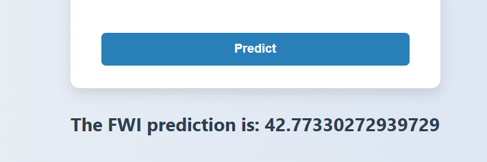

# FWI Prediction Web App

A modern, responsive web application for predicting the Fire Weather Index (FWI) using machine learning.

## Features

- **Clean UI:** Stylish, user-friendly form with a soft gradient background and subtle shadows.
- **Input Fields:** Enter weather and fire indices such as Temperature, RH, Ws, Rain, FFMC, DMC, ISI, Classes, and Region.
- **Instant Prediction:** Submit your data to receive an FWI prediction instantly.
- **Responsive Design:** Looks great on all devices.

## Screenshots



## Usage

1. **Clone the repository:**
    ```bash
    git clone https://github.com/hirux06/algerian-ff-lr.git
    cd algerian-ff-lr
    ```

2. **Run the Flask server:**
    ```bash
    python app.py
    ```

3. **Open your browser:**  
    Visit `http://localhost:5000` to access the app.

4. **Enter the required data:**  
    Fill in all fields and click **Predict** to get the FWI prediction.

5. **Before all this, please run this:**
    ```bash
    pip install -r requirements.txt
    ```

## Input Fields

| Field        | Description                |
|--------------|---------------------------|
| Temperature  | Ambient temperature (°C)  |
| RH           | Relative Humidity (%)     |
| Ws           | Wind Speed (km/h)         |
| Rain         | Rainfall (mm)             |
| FFMC         | Fine Fuel Moisture Code   |
| DMC          | Duff Moisture Code        |
| ISI          | Initial Spread Index      |
| Classes      | Fire class label          |
| Region       | Region code or name       |

## Example

```text
Temperature: 25
RH: 40
Ws: 15
Rain: 0
FFMC: 85
DMC: 120
ISI: 10
Classes: 1
Region: 2
```

## Technologies Used

- **HTML5 & CSS3:** For the frontend UI.
- **Flask:** Backend server for handling predictions.
- **Python:** Machine learning model integration.

## License

This project is licensed under the [MIT License](LICENSE.md).

---

**FWI Prediction** – Predicting fire risk, beautifully.
